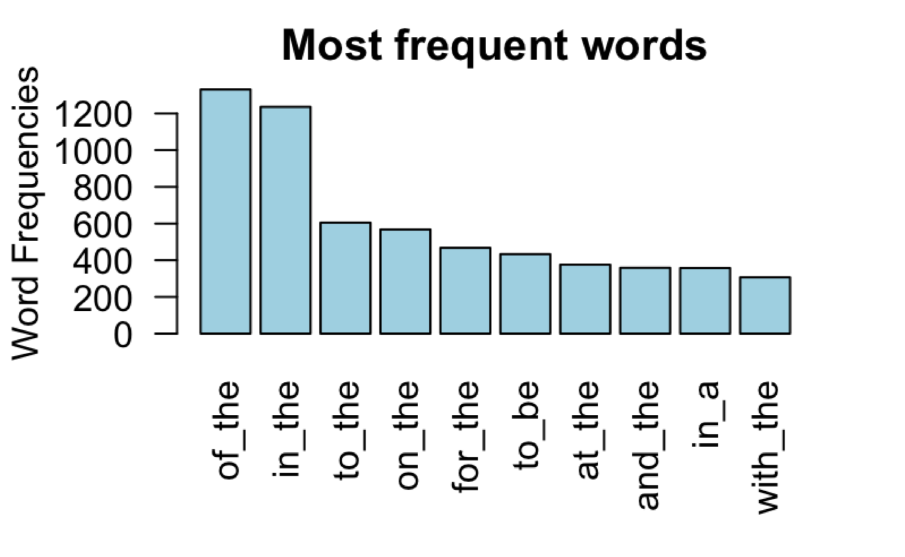
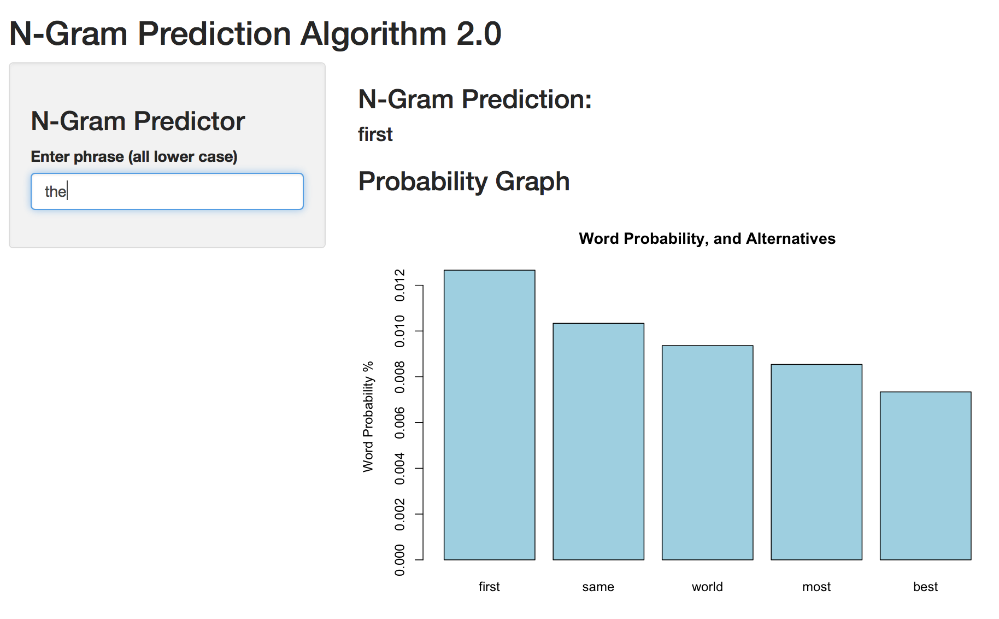

Data Science Capstone Presentation
========================================================
author: Patrick Barajas
date: 6/16/17
autosize: true

Introduction
========================================================

- The goal pof this capstone project was to build a shiny application were you can input a word and output the next possible word in the sentence or phrase.
- In order to create our prediction algorithm we used a large corpus of text sourced from three files:
  
en_US.blogs.txt  
en_US.news.txt  
en_US.twitter.txt

The Specifications for the text files are :  

|                 | Twitter  | Blogs    | News     |
|-----------------|----------|----------|----------|
| Size            | 316mb    | 261mb    | 262mb    |
| number of Lines | 2360148  | 899288   | 1010242  |
| number of Words | 32793399 | 39120549 | 36721087 |
| number of Words | 32793399 | 39120549 | 36721087 |

- [Coursera Data Science Capstone](https://www.coursera.org/learn/data-science-project/home/welcome)
- [Shiny Application](https://barajaspatrick.shinyapps.io/ngrampredictionfile10/)
- [Data Sets](https://d396qusza40orc.cloudfront.net/dsscapstone/dataset/Coursera-SwiftKey.zip)

Data Cleaning and Analysis
========================================================
- 5000 lines of text were randomly sampled from each text file (more would have been sampled but due to RAM restrictions 15000 lines of text is what the computer could handle at the time). A large corpus was created with the samples.
- With the 'tm' package, we removed punctuations, numbers, whitespaces, and converted all the text to lowercase.
- The n-gram package was then used to create 1,2,3-gram text data frames:

|         |   "word1" |  "word2"  |  "freq"  |
|---------|-----------|-----------|----------|
|"of_the" |   "of"    |   "the"   |   1268   |
|"in_the" |   "in"    |   "the"   |   1108   |
|"to_the" |   "to"    |   "the"   |    629   |
|"on_the" |   "on"    |   "the"   |    561   |
|"for_the"|   "for"   |   "the"   |    535   |

Prediction Algorithm
========================================================
- Using the n-gram data frames we created, a prediction algorithm was developed to find the next word in a phrase.
- Our alorithm serched for a n-gram beginning with the first two words inputed by the user with the highest use frequency.
- The third word in the phrase with the highest use frequency was then returned to the user.

Use Instructions
========================================================

- To use the application enter either one word in the input box to revieve an output with the next probable output:

- Please be patient as each prediction can take up to 3 seconds.

